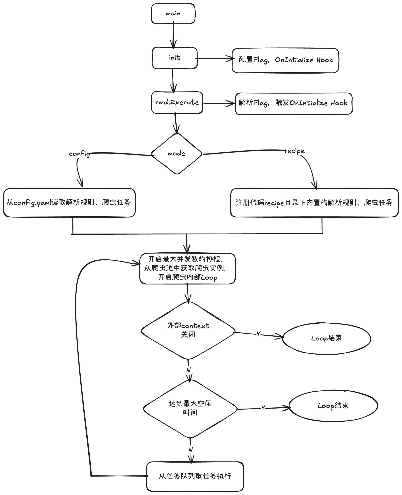

# crawler-go

一个基于 Go 语言的高性能网络爬虫框架，支持并发爬取、规则化解析、数据收集等特性。通过简单的命令行方式即可开始爬虫！

Crawler is a high performance crawler framework that helps you crawl easily.

```bash

Usage:
  crawler [flags]
  crawler [command]

Available Commands:
  completion  Generate the autocompletion script for the specified shell
  help        Help about any command
  recipe      crawler pre-configed recipes

Flags:
      --config string          Start crwal from specied config file. (default "./config/config.yaml")
      --connTimeout duration   The maximum amount of time to wait for a TCP connection to be established (including DNS lookup and the three-way handshake). (default 3s)
      --dialTimeout duration   The total amount of time to wait for a HTTP connection. (default 3s)
      --goroutine int          The maximum groutines to use. (default 10)
  -h, --help                   help for crawler
      --maxIdleTime duration   The maximum idle time for a crawler to finish. (default 3s)
  -m, --mode string            Start crwal from which mode, support [config | recipe] (default "config")
  -r, --run string             The specified recipe hard-coded.
      --worker int             The maximum groutines to use. (default 10)

Use "crawler [command] --help" for more information about a command.

```

## 特性

- **高并发架构**：支持配置并发数和 Worker 数量，充分利用多核 CPU 性能
- **规则化解析**：基于规则的解析引擎，支持灵活的数据提取逻辑
- **URL 去重**：使用 Bloom Filter 实现高效的 URL 去重
- **robots.txt 支持**：自动遵守目标网站的 robots.txt 协议
- **数据收集管道**：支持批量数据收集和处理
- **字符编码自动转换**：自动检测并转换页面编码为 UTF-8
- **完整的 HTTP 支持**：支持 Cookie、重试、超时、重定向等配置
- **优雅停止**：基于 context 的协程生命周期管理

## 项目结构

```
crawler-go/
├── cmd/               # 命令行参数
├── internal/
│   ├── app.go         # 应用主逻辑
│   ├── spider/        # 爬虫规则引擎
│   ├── process/       # 任务处理和爬虫池
│   ├── collect/       # 数据收集
│   ├── filter/        # URL 过滤 (Bloom Filter + robots.txt)
│   ├── fetch/         # 网络请求
│   └── status/        # 状态管理
├── pkg/
│   ├── log/           # 日志组件
│   ├── retry/         # 重试机制
│   └── utils/         # 工具函数
├── recipe/           # 内置爬虫
│   ├── douban/        # 豆瓣电影爬虫
│   └── quotes/        # quotes.toscrape.com 爬虫
└── config/            # 配置文件
```

## 实现原理



## 快速开始

### 安装

```bash

go get github.com/chenyukang1/crawler

```

### 基本用法

```bash

go build .

./crawler

```

## 配置

通过 `config/config.yaml` 文件配置爬虫参数：

```yaml
crawler:
  parallelism: 10 # 并发爬虫数量
  worker: 10 # Worker 数量
  idleTime: 5 # 空闲超时时间（秒）
```

## 核心组件

### Spider（爬虫规则）

爬虫规则是数据提取的核心，通过定义多个 Rule 来实现复杂的数据提取逻辑：

```go
s := &spider.Spider{
    Name:        "爬虫名称",
    Description: "爬虫描述",
    Rules: map[string]*spider.Rule{
        "RuleName": {
            Name: "规则名称",
            Run: func(ctx *spider.Context) {
                // 解析逻辑
            },
        },
    },
    EntryRule: "入口规则名称",
}
```

### CrawlTask（爬取任务）

配置爬取任务的各种参数：

```go
task := &process.CrawlTask{
    URL:           "https://example.com",        // 目标 URL
    Method:        "GET",                        // 请求方法
    Header:        http.Header{},                // 请求头
    EnableCookie:  true,                         // 启用 Cookie
    PostData:      "key=value",                  // POST 数据
    DialTimeout:   time.Second,                  // 连接超时
    ConnTimeout:   3 * time.Second,              // 读写超时
    RedirectTimes: -1,                          // 重定向次数（-1 表示不限制）
    Priority:      0,                           // 优先级
    Reloadable:    false,                        // 是否允许重复下载
    SpiderName:    "spider_name",                // 爬虫名称
    RuleName:      "rule_name",                  // 规则名称
    ShouldFilter:  true,                         // 是否过滤
    Retry: &retry.BackoffRetry{
        ReTryTimes: 3,                           // 重试次数
        Interval:   time.Second,                 // 重试间隔
    },
}
```

### Context（解析上下文）

在规则函数中，通过 Context 获取页面内容：

```go
func(ctx *spider.Context) {
    // 获取 HTML 内容
    html, err := ctx.GetHTML()

    // 获取 DOM 对象（基于 goquery）
    dom, err := ctx.GetDom()

    // 获取原始请求和响应
    req := ctx.Request
    resp := ctx.Response

    // 存储提取的数据
    data := collect.NewDataCell()
    data.Set("key", "value")
    ctx.StructuredData = append(ctx.StructuredData, data)
}
```

### Collector（数据收集）

收集器负责处理提取的数据，可以通过自定义 Collector 实现不同的数据存储方式：

```go
// 默认使用日志收集器
// 可以自定义收集器实现数据入库等操作
```

## 示例

项目包含两个完整的示例：

1. **豆瓣电影爬虫** (`example/douban/movie_v2.go`) - 爬取豆瓣电影正在上映和即将上映的电影信息
2. **Quotes 爬虫** (`example/quotes/quotes.go`) - 演示登录后爬取 quotes.toscrape.com

运行示例：

```bash

go run main.go --recipe --run douban-movie

go run main.go --recipe --run quotes

```

## 依赖

- [github.com/PuerkitoBio/goquery](https://github.com/PuerkitoBio/goquery) - HTML 解析
- [github.com/temoto/robotstxt](https://github.com/temoto/robotstxt) - robots.txt 解析
- [github.com/spf13/viper](https://github.com/spf13/viper) - 配置管理

## 许可证

MIT License
